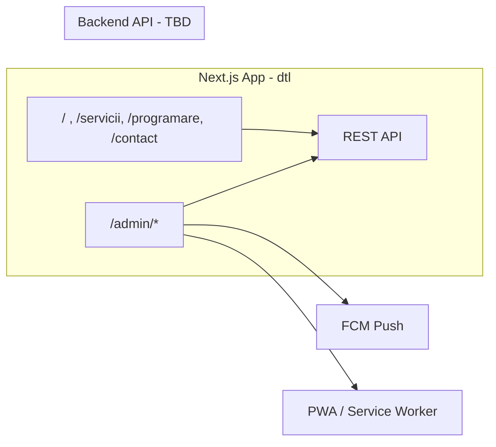

# Car Service Application – Implementation Plan

Based on [Specs.md](Specs.md), [design-preparation.md](design-preparation.md), and [figma.md](figma.md). Current codebase: **dtl/** (Next.js 16, App Router, Tailwind 4, TypeScript). All paths below are relative to **dtl/** unless noted.

---

## How to Build (Order of Work)

1. **Phase 1** – Foundation (routes skeleton, API client, feature flags, i18n, root layout). Required before anything else.
2. **Phase 2** – Customer app (Home, Servicii, Programare, Contact, shared components). Can use mocked/static data until API exists.
3. **Phase 3** – Admin core (auth, layout, Dashboard, Business Settings, Feature Flags). Technician: calendar + mark job done only.
4. **Phase 4** – Admin extended (calendars, appointments, services, users, content). Depends on Phase 3.
5. **Phase 5** – PWA + FCM for admin push. Depends on Phase 3/4.
6. **Backend** – Separate package; frontend consumes via `NEXT_PUBLIC_API_URL`. Can stub API in frontend until backend exists.

**Verification after each phase (from dtl/):**
- `npm run build`
- `npm run lint`
- `npx tsc --noEmit` (add `"typecheck": "tsc --noEmit"` to package.json if desired)

---

## Architecture Overview

- **Single Next.js app:** Customer routes at root; Admin under `/admin`. Backend is a separate package (monorepo); frontend uses `NEXT_PUBLIC_API_URL` (see dtl/.env.example).
- **Feature flags:** Two-tier (Super Admin enables; Admin shows/hides). Tyre and Car Wash are optional (flags). Default when no API: all flags ON.

---

## Phase 1: Foundation and Shared Infrastructure

**Goal:** Routing skeleton, API client, feature flags, i18n, root layout. Everything else builds on this.

### 1.1 Route skeleton (App Router)

- [ ] **Customer routes** (dtl/app/):
  - `page.tsx` – Home (already exists; update content later).
  - `servicii/page.tsx` – Services list (placeholder).
  - `programare/page.tsx` – Booking (placeholder).
  - `contact/page.tsx` – Contact (placeholder).
  - `cont/page.tsx` – Authenticated customer: appointments + invoices (placeholder).
- [ ] **Admin routes** (dtl/app/admin/):
  - `layout.tsx` – Auth guard + admin shell (nav, role-aware). Redirect unauthenticated to login.
  - `page.tsx` – Dashboard (placeholder).
  - `login/page.tsx` – Admin login (placeholder).
  - `calendar/page.tsx` – Staff calendar (placeholder).
  - `appointments/page.tsx` – Appointment list (placeholder).
  - `settings/page.tsx` – Business settings (placeholder).
  - `feature-flags/page.tsx` – Feature flags (placeholder).
  - `services/page.tsx` – Service CRUD (placeholder).
  - `users/page.tsx` – User management (placeholder).

### 1.2 API client

- [ ] Create **dtl/lib/api-client.ts** (or dtl/src/lib/api-client.ts):
  - Single module: all HTTP via `fetch` to `process.env.NEXT_PUBLIC_API_URL`.
  - Typed error: `{ kind: 'network' | 'http' | 'parse'; status?: number; message: string; retriable?: boolean }`.
  - No hardcoded URLs; no secrets in logs (per .cursor/rules/rest-api.mdc).

### 1.3 Feature flags

- [ ] Create **dtl/lib/feature-flags.ts**:
  - Fetch flags from API when available; until then use **default: all ON** (Tyre, Car Wash, all booking flags, Parts Ordering, Card Installment).
  - Export a small API: e.g. `getFeatureFlags()`, `isModuleEnabled('tyre' | 'carWash')`, `isBookingEnabled('general' | 'tyre' | 'carWash')`, etc.
- [ ] Use in layout and pages to hide nav/links/routes for disabled modules (e.g. hide Tyre/Wash tabs when flags off).

### 1.4 i18n (Romanian, future-ready)

- [ ] Create **dtl/lib/i18n.ts** (or dtl/messages/ro.json): externalized strings for v1 (Romanian only); structure so more locales can be added later.
- [ ] Set `lang="ro"` in **dtl/app/layout.tsx**.

### 1.5 Root layout and design

- [ ] Update **dtl/app/layout.tsx**: metadata (title, description), viewport, `lang="ro"`, fonts. Add shared customer layout group if needed (e.g. header with contact strip, footer).
- [ ] Design: use Figma MCP `get_design_context` (fileKey `JcgKSBJg35eQwk1zig9H6e`, nodeId `0:0`) and reuse components/styles; if issues, ask user—no fallback.

### 1.6 Verification

- [ ] From dtl: `npm run build`, `npm run lint`, `npx tsc --noEmit`.
- [ ] All new routes render (placeholders OK); no broken links in nav.

---

## Phase 2: Customer-Facing Application

**Goal:** Home, Servicii, Programare (tabs), Contact, shared contact/Map; optional Card Installment ad. Use mocked/static data until API exists.

### 2.1 Shared customer UI

- [ ] **Header/footer** (or layout group): persistent phone + email (from Business Settings; mock for now). Same on Home, Servicii, Programare, Contact.
- [ ] **Google Map component**: one component; address from settings (mock for now). Use on Home and Contact.

### 2.2 Home (/)

- [ ] Hero, service categories: General Service always; Tyre and Car Wash only if feature flags on.
- [ ] Contact (phone, email), address, embedded map. Data from API/mock.

### 2.3 Servicii (/servicii)

- [ ] List services with prices and images from catalog; respect module flags. CTA “Request appointment” when relevant booking flag on (links to /programare).

### 2.4 Programare (/programare)

- [ ] Shown only when at least one booking flag on; otherwise redirect or hide link.
- [ ] **Tabs** (respect flags): Service (General) when General Service booking on; Tyre when Tyre module + booking on; Wash when Car Wash module + booking on.
- [ ] Form: initial booking type = selected tab; user can change type in form (dropdown or tabs). Fields: Name, Phone, Email, Car (Make, Model, Year – free text), Problem (textarea), optional service list (catalog for selected type), Date, Time (slots for that type, 30-day window), optional photo. Submit = appointment **request** (API/mock). Guest allowed; guest linking handled by backend later.

### 2.5 Contact (/contact)

- [ ] Phone, email, address, map. Same persistent contact as elsewhere.

### 2.6 Card Installment (ads only)

- [ ] When Card Installment flag on: show configurable ad/promo message (no payment). Admin configures message/placement later; use a simple placeholder component for now.

### 2.7 Authenticated customer (/cont)

- [ ] After login: list appointments (requested, confirmed, completed) and invoices (final price + optional lines). Encourage sign-up on booking form. Guest-linked history when backend supports it.

### 2.8 Verification

- [ ] `npm run build`, `npm run lint`, `npx tsc --noEmit`.
- [ ] Mobile-responsive; nav and tabs respect feature flags.

---

## Phase 3: Admin Web Application – Core

**Goal:** Auth, admin layout, Dashboard, Business Settings, Feature Flags. Technician: only calendar + mark job done.

### 3.1 Auth and admin layout

- [ ] **Admin auth:** login (email/password or chosen scheme); store session (e.g. JWT in httpOnly cookie or session storage per backend contract). Protect all `/admin/*` except `/admin/login`.
- [ ] **dtl/app/admin/layout.tsx:** If not logged in → redirect to `/admin/login`. If logged in: render nav + role-aware menu. **Technician:** only “Calendar” and “Mark job done” (no Dashboard, Settings, Feature Flags, Users, Services, Appointments list).

### 3.2 Dashboard (/admin)

- [ ] Revenue and service volume (daily/weekly/monthly) for **active** modules only. Use API/mock.

### 3.3 Business Settings (/admin/settings)

- [ ] Contact (phone, email), address, operating hours (per day + exceptions), Romanian holidays (auto), extra off days/hours, slot duration per type (General, Tyre, Car Wash – default 1h). When Card Installment flag on: Admin configures ad message and placement (ads only).

### 3.4 Feature Flags (/admin/feature-flags)

- [ ] Super Admin: enable/disable Tyre, Car Wash, each booking flag, Parts Ordering, Card Installment. Admin: show/hide to customers for each enabled flag. Changes apply system-wide (disabled = fully hidden, no “coming soon”).

### 3.5 Verification

- [ ] `npm run build`, `npm run lint`, `npx tsc --noEmit`.
- [ ] Technician sees only calendar + mark job done; no other admin pages in nav.

---

## Phase 4: Admin – Calendars, Appointments, Services, Users

**Goal:** Staff calendar (3 types), appointment management, service/pricing CRUD, user management, content (images).

### 4.1 Staff calendar (/admin/calendar)

- [ ] Separate calendars for General Service, Tyre, Car Wash. Views: Day, Week (default), Month. Modes: calendar grid and form (date + time). Slots from API; appointments Pending or Confirmed. Technician: same calendar but only assigned jobs + “Mark job done”.

### 4.2 Appointment management (/admin/appointments)

- [ ] List requests; actions: confirm (set slot), modify slot, delete. Click-to-call and click-to-SMS (open device dialer/SMS with customer number). Not visible to Technician (or read-only if desired).

### 4.3 Service and pricing (/admin/services)

- [ ] CRUD: General Vehicle Services, Tyre services, Car Wash packages (separate sections), each with pricing. Optional booking lists (General, Tyre, Car Wash) with default Romanian labels (see Specs.md §5.2).

### 4.4 Vehicle types (optional)

- [ ] Admin CRUD for makes/models (internal reference). Customer form stays free-text.

### 4.5 User management (/admin/users)

- [ ] Staff: create/edit Admin and Technician (Super Admin/Admin only). Customers: list; staff can create customer accounts. No self-service admin sign-up.

### 4.6 Content – images

- [ ] Admin UI to manage photos for customer-facing app (gallery, services). Storage/API TBD with backend.

### 4.7 Verification

- [ ] `npm run build`, `npm run lint`, `npx tsc --noEmit`.

---

## Phase 5: PWA and Push Notifications (Admin)

**Goal:** Admin app installable; staff get push when a new appointment request is created.

### 5.1 PWA

- [ ] **dtl/public/manifest.json:** name, short_name, icons (192×192, 512×512), start_url, display.
- [ ] Register service worker (Workbox or custom); lazy registration, do not block initial render. Icons in dtl/public/.

### 5.2 Firebase Cloud Messaging

- [ ] Integrate FCM for web push; service worker handles push and shows notification. Backend triggers FCM when a new request is submitted; frontend only consumes (subscribe, receive, display).

### 5.3 Verification

- [ ] `npm run build`; PWA installable; push received when backend sends (or manual test payload).

---

## Phase 6: Backend API (Separate Workstream)

**Goal:** Backend is a separate package in the monorepo; frontend consumes via `NEXT_PUBLIC_API_URL`. No frontend route or storage key changes without BREAKING and migration notes.

- [ ] Add backend package (e.g. api/ or backend/) at repo root when backend spec exists.
- [ ] Contract (for frontend): Auth (JWT or session), Business Settings, Feature Flags, Service Catalogs, Slots & Appointments, Users, Invoices, (optional) Parts, Tyre inventory, Car Wash queue. REST; base URL from env.
- [ ] Guest linking: on customer registration/first login, backend links guest submissions (same email); appointment history returns merged list.
- [ ] Notifications: backend sends confirmation emails (request received, appointment confirmed) and triggers FCM for new request; no backend SMS (staff use click-to-call/SMS).

---

## Verification and Conventions

- **Build:** From dtl: `npm run build`, `npm run lint`, `npx tsc --noEmit`. Add `"typecheck": "tsc --noEmit"` to dtl/package.json if desired.
- **Mobile:** All pages responsive and mobile-first (see .cursor/rules/mobile-responsive.mdc).
- **Env:** Use only variables from dtl/.env.example; never commit secrets.

---

## Summary of Deliverables

| Area       | Deliverables |
| ---------- | ------------ |
| Foundation | Routes, API client, feature flags, i18n (RO), root layout, Figma design alignment |
| Customer   | Home, Servicii, Programare (tabs by flags), Contact, Map, persistent contact, guest + auth booking, guest linking, /cont (appointments + invoices), Card Installment ads |
| Admin      | Auth + roles (Technician: calendar + mark job done only), Dashboard, Business Settings, Feature Flags, Calendars (3), Appointments, Service/Pricing CRUD, User management, Content (images) |
| PWA/Push   | Manifest, service worker, FCM for admin push on new requests |
| Backend    | Separate package and spec; frontend consumes via single client and env base URL |
